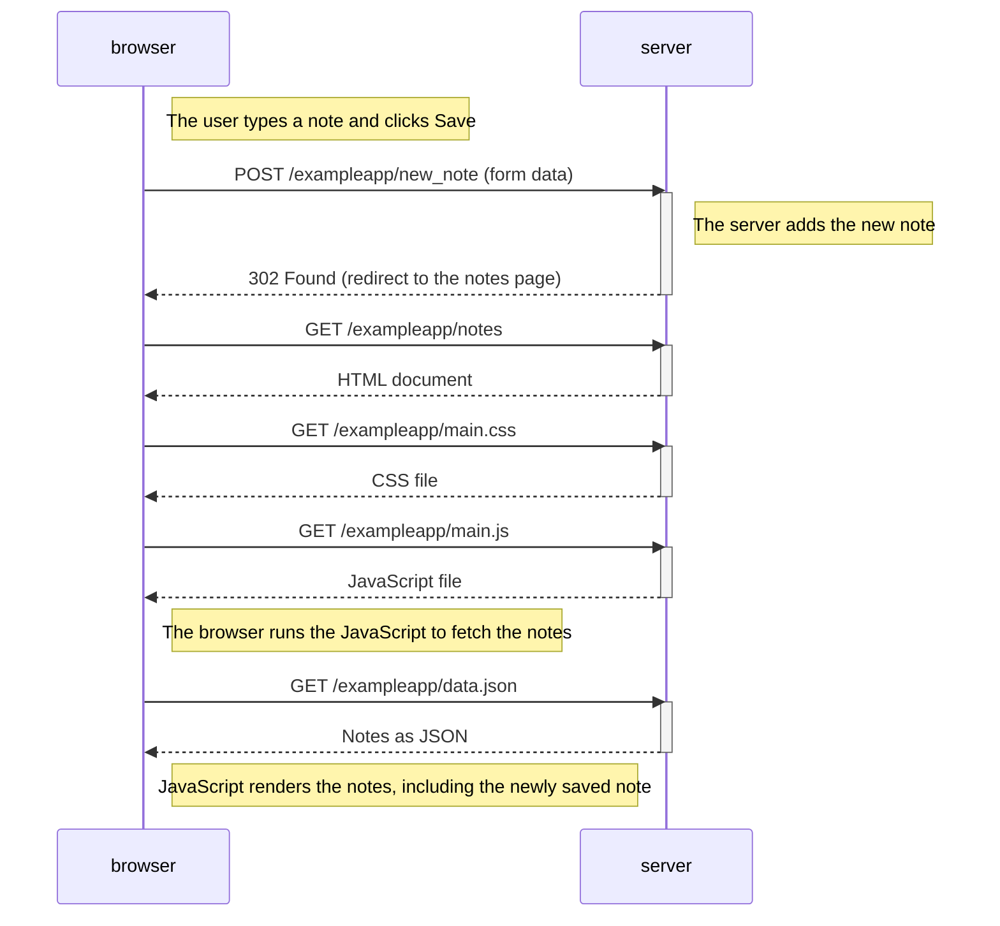

```mermaid
sequenceDiagram
    participant browser
    participant server

    Note right of browser: The user types a note and clicks Save
    browser->>server: POST /exampleapp/new_note (form data)
    activate server
    Note right of server: The server adds the new note
    server-->>browser: 302 Found (redirect to the notes page)
    deactivate server

    browser->>server: GET /exampleapp/notes
    activate server
    server-->>browser: HTML document
    deactivate server

    browser->>server: GET /exampleapp/main.css
    activate server
    server-->>browser: CSS file
    deactivate server

    browser->>server: GET /exampleapp/main.js
    activate server
    server-->>browser: JavaScript file
    deactivate server

    Note right of browser: The browser runs the JavaScript to fetch the notes
    browser->>server: GET /exampleapp/data.json
    activate server
    server-->>browser: Notes as JSON
    deactivate server

    Note right of browser: JavaScript renders the notes, including the newly saved note
```
