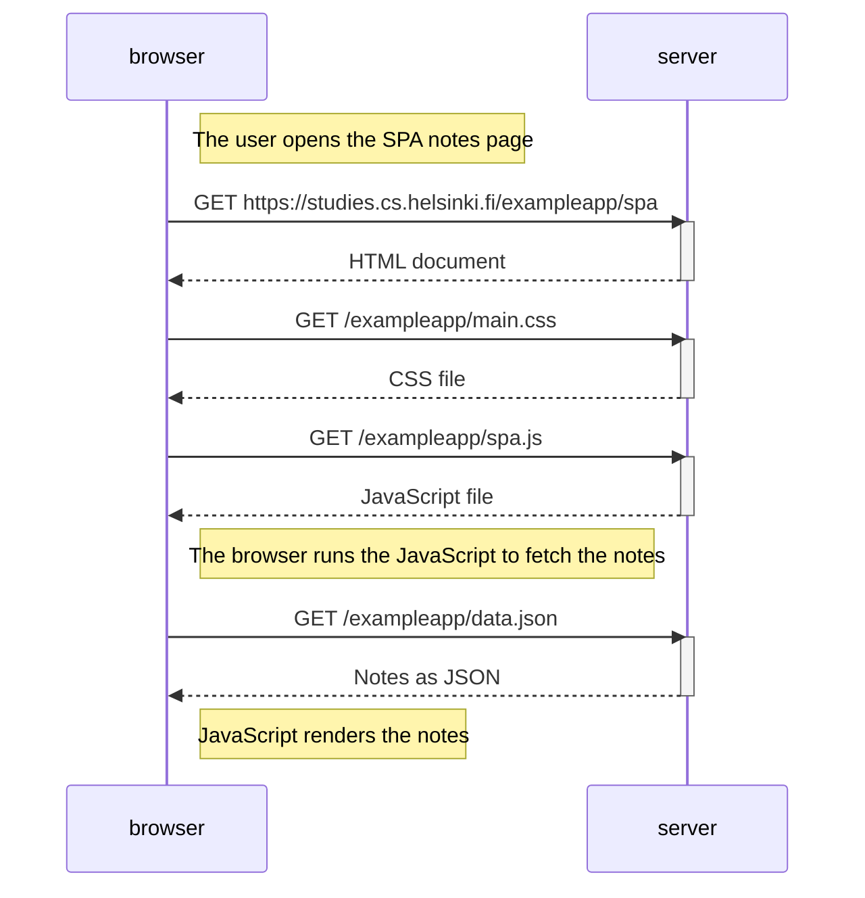

```mermaid
sequenceDiagram
    participant browser
    participant server

    Note right of browser: The user opens the SPA notes page
    browser->>server: GET https://studies.cs.helsinki.fi/exampleapp/spa
    activate server
    server-->>browser: HTML document
    deactivate server

    browser->>server: GET /exampleapp/main.css
    activate server
    server-->>browser: CSS file
    deactivate server

    browser->>server: GET /exampleapp/spa.js
    activate server
    server-->>browser: JavaScript file
    deactivate server

    Note right of browser: The browser runs the JavaScript to fetch the notes
    
    browser->>server: GET /exampleapp/data.json
    activate server
    server-->>browser: Notes as JSON
    deactivate server

    Note right of browser: JavaScript renders the notes
```
