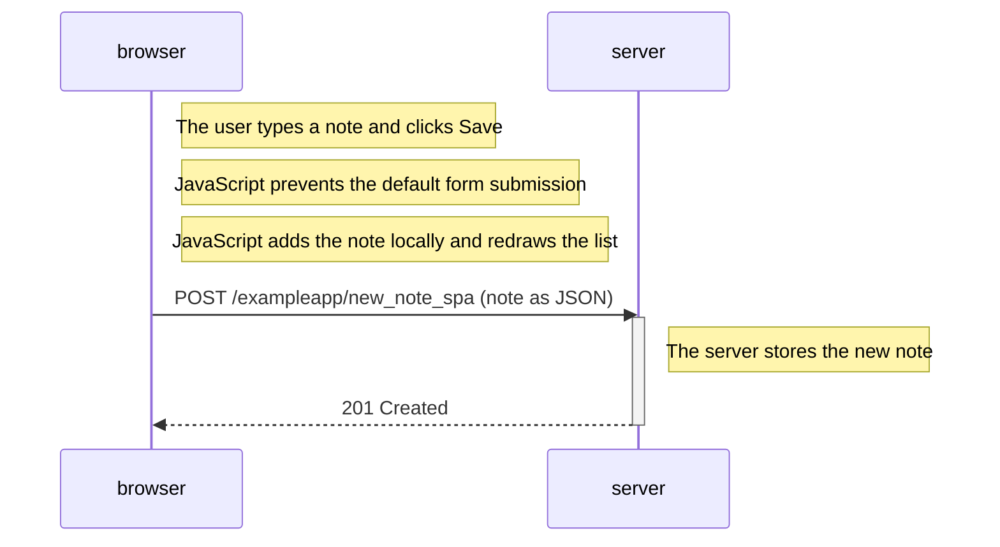

```mermaid
sequenceDiagram
    participant browser
    participant server

    Note right of browser: The user types a note and clicks Save
    Note right of browser: JavaScript prevents the default form submission
    Note right of browser: JavaScript adds the note locally and redraws the list

    browser->>server: POST /exampleapp/new_note_spa (note as JSON)
    activate server
    Note right of server: The server stores the new note
    server-->>browser: 201 Created
    deactivate server
```
